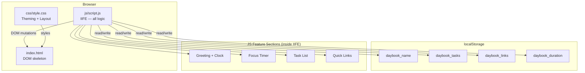
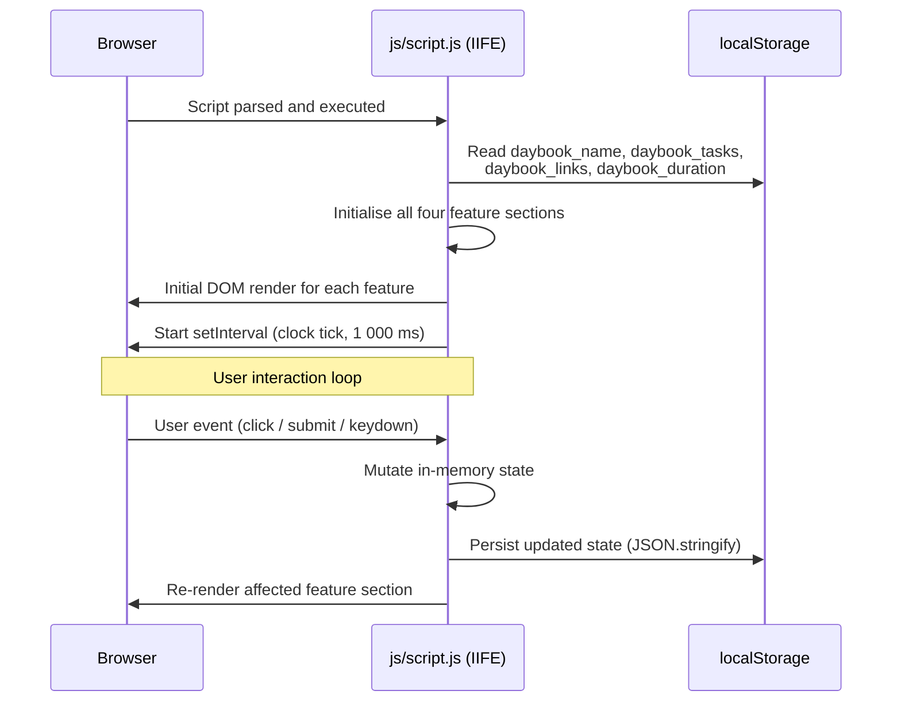
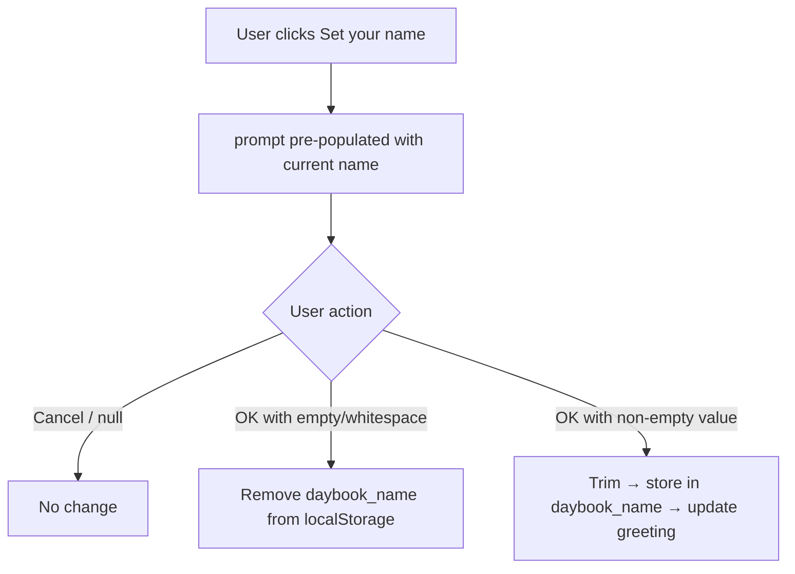
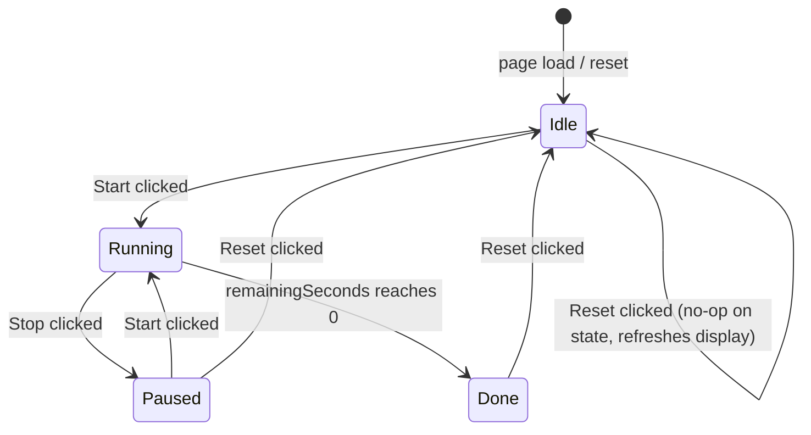
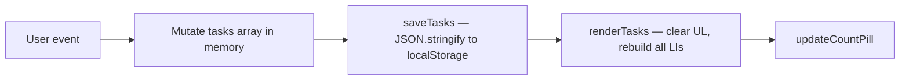

# Design Document — Daybook: To-Do List Life Dashboard

> **Note:** This is retroactive documentation. The system described here is already implemented.
> The design reflects the actual architecture of `index.html`, `css/style.css`, and `js/script.js`.

---

## Overview

Daybook is a zero-dependency, single-page personal dashboard. It runs entirely in the browser with no build step, no server, and no external runtime — just three files opened directly from disk or a static host.

The page integrates four independent, self-contained features:

| Feature | Responsibility |
|---|---|
| Greeting + Clock | Displays current time, date, and a personalised time-of-day greeting |
| Focus Timer | Pomodoro countdown with configurable duration and SVG ring visualisation |
| Task List | CRUD to-do list with inline editing, duplicate prevention, and done tracking |
| Quick Links | Persistent shortcut chips that open URLs in a new tab |

All state is stored exclusively in `localStorage`. There is no network I/O.

### High-Level Component Diagram



---

## Architecture

### Design Principles

1. **No shared mutable state across features.** Each feature section owns its own `let` variables. There are no cross-feature function calls or shared objects.
2. **Write-then-render.** Every mutation follows the same pattern: update in-memory array → persist to `localStorage` → call the full re-render function for that feature.
3. **Load-once initialisation.** When the IIFE executes on `DOMContentLoaded` (or immediately on parse since the script is deferred), each feature reads its `localStorage` key, validates it, and populates its in-memory state. No lazy loading occurs.
4. **No framework abstraction.** DOM querying is done directly via `document.getElementById` / `querySelector`. There is no virtual DOM, no data binding, and no component lifecycle.

### Execution Model



---

## File / Module Structure

The project is intentionally flat. There are exactly three source files.

```
index.html          — Page skeleton, DOM structure, Google Fonts link
css/
  style.css         — All visual design: custom properties, layout, components
js/
  script.js         — All application logic (one IIFE, four feature sections)
```

### `js/script.js` Internal Structure

Because `script.js` uses a single IIFE with no modules, logical separation is achieved through clearly delimited comment blocks:

```
(function () {
  'use strict';

  // ── CONSTANTS ──────────────────────────────────────────────────────────
  const KEYS = { NAME, TASKS, LINKS, DURATION }
  const RING_CIRCUMFERENCE = 552.9   // 2π × r=88

  // ── SECTION 1: GREETING + CLOCK ────────────────────────────────────────
  // DOM refs, updateClock(), setInterval

  // ── SECTION 2: FOCUS TIMER ─────────────────────────────────────────────
  // DOM refs, state vars, tick(), start/stop/reset handlers, settings panel

  // ── SECTION 3: TASK LIST ───────────────────────────────────────────────
  // DOM refs, tasks[], addTask(), renderTasks(), toggleDone(), deleteTask()
  // inline editing handlers, duplicate check, saveTasks()

  // ── SECTION 4: QUICK LINKS ─────────────────────────────────────────────
  // DOM refs, links[], addLink(), renderLinks(), deleteLink(), saveLinks()

})();
```

---

## Data Models

### Task

```js
{
  id:   string,   // crypto.randomUUID() — e.g. "f47ac10b-58cc-4372-a567-0e02b2c3d479"
  text: string,   // trimmed, 1–200 characters
  done: boolean   // false on creation; toggled by checkbox
}
```

### Link

```js
{
  id:   string,   // crypto.randomUUID()
  name: string,   // trimmed, 1–50 characters
  url:  string    // always begins with "http://" or "https://" (normalised on save)
}
```

### localStorage Schema

| Key | Type stored | Constraints |
|---|---|---|
| `daybook_name` | `string` | Non-empty after trim; absent when cleared |
| `daybook_tasks` | JSON `Array<Task>` | Valid JSON; each element satisfies Task shape |
| `daybook_links` | JSON `Array<Link>` | Valid JSON; each element satisfies Link shape; all URLs normalised |
| `daybook_duration` | `string` (numeric) | Integer in `[1, 120]`; coerced with `parseInt` on read |

#### Deserialisation Defence

Every `localStorage` read is wrapped in a `try/catch`:

```js
function loadTasks() {
  try {
    const raw = localStorage.getItem(KEYS.TASKS);
    const parsed = JSON.parse(raw);
    return Array.isArray(parsed) ? parsed : [];
  } catch (_) {
    return [];
  }
}
```

If the value is absent, `null`, or malformed JSON, the feature falls back to an empty array (tasks / links) or the default value (25 minutes for duration). This satisfies Requirements 6.4, 10.9, and 5.5.

---

## Components and Interfaces

This section summarises the public "interface" of each feature component — the functions other code within the IIFE may call, and the DOM elements each component owns. Because the codebase uses no modules or classes, "interface" here means the set of named functions defined in each comment-delimited section.

### Greeting + Clock Interface

| Symbol | Kind | Description |
|---|---|---|
| `updateClock()` | function | Called by `setInterval`; updates all greeting/clock DOM nodes. |
| `setName()` | function | Opens `prompt()`, validates input, persists name, calls `updateClock()`. |

**Owned DOM nodes:** `#clock`, `#date`, `#greeting`, `#set-name-btn`

---

### Focus Timer Interface

| Symbol | Kind | Description |
|---|---|---|
| `startTimer()` | function | Starts the countdown `setInterval`. |
| `stopTimer()` | function | Clears the `setInterval`; updates button states. |
| `resetTimer()` | function | Stops and restores `remainingSeconds` to `totalSeconds`. |
| `tick()` | function | Internal tick handler; decrements counter; updates ring + display. |
| `saveSettings(minutes)` | function | Validates and persists new duration; resets timer. |
| `toggleSettings()` | function | Shows/hides the settings panel. |
| `durationMinutes` | `let` var | Current configured duration in minutes. |
| `remainingSeconds` | `let` var | Current countdown value in seconds. |
| `isRunning` | `let` var | Boolean; `true` while interval is active. |

**Owned DOM nodes:** `#timer-display`, `#timer-ring`, `#start-btn`, `#stop-btn`, `#reset-btn`, `#settings-panel`, `#duration-input`, `#settings-save-btn`, `#settings-toggle-btn`

---

### Task List Interface

| Symbol | Kind | Description |
|---|---|---|
| `addTask(text)` | function | Validates, creates, appends, saves, re-renders. |
| `deleteTask(id)` | function | Removes by id, saves, re-renders. |
| `toggleDone(id)` | function | Flips `done` boolean, saves, re-renders. |
| `beginEdit(li, task)` | function | Activates inline edit on a task element. |
| `commitEdit(li, task)` | function | Validates and commits or deletes on empty. |
| `cancelEdit(li, task)` | function | Reverts to pre-edit text. |
| `isDuplicate(text, excludeId?)` | function | Returns `true` if normalised text collides with an existing task. |
| `saveTasks()` | function | Serialises `tasks` to `localStorage`. |
| `renderTasks()` | function | Full re-render of the task `<ul>`. |
| `tasks` | `let` var | In-memory `Array<Task>`. |

**Owned DOM nodes:** `#task-form`, `#task-input`, `#task-list`, `#task-count`, `#task-empty`, `#duplicate-hint`

---

### Quick Links Interface

| Symbol | Kind | Description |
|---|---|---|
| `addLink(name, url)` | function | Validates, normalises URL, creates, saves, re-renders. |
| `deleteLink(id)` | function | Removes by id, saves, re-renders. |
| `normalizeUrl(url)` | function | Prepends `https://` if no scheme present. |
| `saveLinks()` | function | Serialises `links` to `localStorage`. |
| `renderLinks()` | function | Full re-render of the chip container. |
| `links` | `let` var | In-memory `Array<Link>`. |

**Owned DOM nodes:** `#link-form`, `#link-name-input`, `#link-url-input`, `#link-chips`, `#link-empty`

---

## Component Designs

### Component 1: Greeting + Clock

**DOM target:** `<header class="greeting-card">`

**State variables (inside IIFE scope):**
- None persistent; state is read from `localStorage` and `Date` on every tick.

**Key functions:**

| Function | Responsibility |
|---|---|
| `updateClock()` | Called by `setInterval` every 1 000 ms. Reads `new Date()`, formats time and date strings, computes greeting phrase from current hour, appends stored name if present, writes to DOM. |
| `getGreetingPhrase(hour)` | Pure function. Maps integer `[0–23]` to one of four phrase strings. |
| `formatTime(date)` | Pure function. Returns `HH:MM:SS` string from a `Date` object using `padStart(2, '0')`. |
| `formatDate(date)` | Pure function. Returns `"{Weekday}, {D} {Month} {YYYY}"` string. |

**Greeting logic:**

```
hour ∈ [0,  4]  →  "Good night"
hour ∈ [5, 11]  →  "Good morning"
hour ∈ [12,17]  →  "Good afternoon"
hour ∈ [18,23]  →  "Good evening"
```

Name is appended as `"${phrase}, ${storedName}"` if `localStorage.getItem(KEYS.NAME)` is non-empty.

**Name prompt flow:**



---

### Component 2: Focus Timer

**DOM target:** `<section>` containing `.timer-face`

**State variables:**
```js
let durationMinutes   // integer [1,120]; restored from localStorage or 25
let totalSeconds      // durationMinutes × 60
let remainingSeconds  // current countdown value; integer [0, totalSeconds]
let timerInterval     // setInterval handle; null when stopped
let isRunning         // boolean
```

**SVG Ring:**
- `r = 88` → circumference = `2π × 88 ≈ 552.9` (constant `RING_CIRCUMFERENCE`)
- `stroke-dasharray: 552.9`
- `stroke-dashoffset` is set to: `RING_CIRCUMFERENCE × (1 − remainingSeconds / totalSeconds)`
- Full ring (offset = 0) → full duration remaining; empty ring (offset = 552.9) → zero remaining.

**Key functions:**

| Function | Responsibility |
|---|---|
| `startTimer()` | Guards against double-start; sets `isRunning = true`; creates `setInterval(tick, 1000)`. |
| `stopTimer()` | Clears `timerInterval`; sets `isRunning = false`; updates button states. |
| `resetTimer()` | Calls `stopTimer()`; restores `remainingSeconds = totalSeconds`; updates display. |
| `tick()` | Decrements `remainingSeconds`; updates time display and ring offset; if `remainingSeconds === 0` calls `handleTimerDone()`. |
| `handleTimerDone()` | Calls `stopTimer()`; sets display to "Done!"; collapses ring to zero offset. |
| `formatTimerDisplay(seconds)` | Returns `MM:SS` string from total seconds. On reset with full minute, returns `MM:00`. |
| `setRingOffset(offset)` | Sets `stroke-dashoffset` on the SVG ring element. |
| `saveSettings(minutes)` | Validates `1 ≤ minutes ≤ 120`; stores in `localStorage`; calls `resetTimer()` with new duration. |

**State machine:**



---

### Component 3: Task List

**DOM target:** `<section>` containing `<ul>` task list

**State variables:**
```js
let tasks  // Array<Task>; loaded from localStorage on init
```

**Key functions:**

| Function | Responsibility |
|---|---|
| `loadTasks()` | Reads and deserialises `localStorage[KEYS.TASKS]`; returns `[]` on error. |
| `saveTasks()` | Serialises `tasks` array and writes to `localStorage[KEYS.TASKS]`. |
| `renderTasks()` | Full re-render: clears `<ul>`, creates one `<li>` per task, updates count pill and empty-state. |
| `addTask(text)` | Validates (non-empty, ≤200 chars, no duplicate); creates Task; appends; calls `saveTasks()` + `renderTasks()`. |
| `deleteTask(id)` | Filters `tasks` by id; calls `saveTasks()` + `renderTasks()`. |
| `toggleDone(id)` | Toggles `done` on matched task; calls `saveTasks()` + `renderTasks()`. |
| `beginEdit(li, task)` | Sets `contenteditable="true"` on text element; stores original text for escape-cancel. |
| `commitEdit(li, task)` | Trims text; if empty → `deleteTask`; if duplicate → revert + hint; else update + save + render. |
| `cancelEdit(li, task)` | Restores original text; removes `contenteditable`. |
| `isDuplicate(text, excludeId?)` | Returns `true` if any task (excluding `excludeId`) has matching `text.trim().toLowerCase()`. |
| `updateCountPill()` | Sets pill text to `tasks.filter(t => !t.done).length`. |

**Duplicate check:**

```js
function isDuplicate(candidateText, excludeId = null) {
  const norm = candidateText.trim().toLowerCase();
  return tasks.some(t => t.id !== excludeId && t.text.trim().toLowerCase() === norm);
}
```

**Full re-render pattern:**



---

### Component 4: Quick Links

**DOM target:** `<section>` containing chip list `<div>`

**State variables:**
```js
let links  // Array<Link>; loaded from localStorage on init
```

**Key functions:**

| Function | Responsibility |
|---|---|
| `loadLinks()` | Reads and deserialises `localStorage[KEYS.LINKS]`; returns `[]` on error. |
| `saveLinks()` | Serialises `links` array and writes to `localStorage[KEYS.LINKS]`. |
| `renderLinks()` | Full re-render: clears chip container, creates one chip per link, shows/hides empty-state. |
| `addLink(name, url)` | Validates (non-empty name, non-empty url); normalises URL; creates Link; appends; calls `saveLinks()` + `renderLinks()`. |
| `deleteLink(id)` | Filters `links` by id; calls `saveLinks()` + `renderLinks()`. |
| `normalizeUrl(url)` | If url does not start with `http://` or `https://`, prepends `https://`. |

**Chip rendering:**

Each chip is built as:
```html
<a href="{url}" target="_blank" rel="noopener noreferrer" class="chip">
  {name}
  <button class="chip-remove" aria-label="Remove {name}">✕</button>
</a>
```

The remove button's click handler calls `deleteLink(id)` and stops event propagation so the link is not followed.

---

## Rendering Strategy

Both the Task List and Quick Links use a **full re-render** approach: on every mutation, the container element is cleared and rebuilt from scratch using the current in-memory array.

**Why full re-render instead of incremental DOM updates:**

- The data sets are small (bounded by human cognitive limits — practically < 100 items).
- It eliminates a class of bugs where the DOM diverges from in-memory state.
- It is simpler to reason about: the rendered view is always a pure projection of the `tasks` / `links` array.
- It avoids the need for diffing logic, keyed reconciliation, or element references.

**Re-render sequence (per feature):**

```js
function renderTasks() {
  taskList.innerHTML = '';               // 1. clear
  tasks.forEach(task => {
    const li = buildTaskElement(task);   // 2. build each element
    taskList.appendChild(li);            // 3. append
  });
  updateCountPill();                     // 4. update derived UI
  emptyState.hidden = tasks.length > 0; // 5. toggle empty-state
}
```

The clock does not use this pattern — it updates targeted DOM text nodes in-place on every `setInterval` tick because it has no list structure to re-render.

---

## localStorage Interaction Pattern

All four features follow an identical read/write contract:

### Read (at init)

```js
// Pattern for array features (tasks, links)
function loadItems() {
  try {
    const stored = localStorage.getItem(KEYS.X);
    const parsed = JSON.parse(stored);
    return Array.isArray(parsed) ? parsed : [];
  } catch (_) {
    return [];
  }
}

// Pattern for scalar features (name, duration)
function loadScalar(key, defaultValue) {
  const val = localStorage.getItem(key);
  return val !== null ? val : defaultValue;
}
```

### Write (after every mutation)

```js
// Array features
function saveItems() {
  localStorage.setItem(KEYS.X, JSON.stringify(items));
}

// Scalar features
localStorage.setItem(KEYS.NAME, trimmedName);
localStorage.setItem(KEYS.DURATION, String(minutes));
```

### Key constants (`KEYS` object)

```js
const KEYS = {
  NAME:     'daybook_name',
  TASKS:    'daybook_tasks',
  LINKS:    'daybook_links',
  DURATION: 'daybook_duration',
};
```

Having all keys in one object prevents typo-introduced key mismatches between reads and writes.

---

## CSS Theming Approach

### Custom Properties

All design tokens are defined on `:root` and overridden in a `[data-theme="dark"]` selector block:

```css
:root {
  --color-paper:   #f5f0e8;   /* page background */
  --color-card:    #fffef9;   /* card/section background */
  --color-ink:     #2c2c2c;   /* primary text */
  --color-teal:    #2a9d8f;   /* accent / interactive */
  --color-coral:   #e76f51;   /* secondary accent */
  --color-danger:  #d62828;   /* destructive actions */
  --shadow:        0 2px 12px rgba(0,0,0,.08);
  --radius:        12px;
  --font-display:  'Fraunces', serif;
  --font-body:     'Inter', sans-serif;
  --font-mono:     'JetBrains Mono', monospace;
}

[data-theme="dark"] {
  --color-paper:  #1a1a2e;
  --color-card:   #16213e;
  --color-ink:    #e0e0e0;
  /* ... overrides only for values that change */
}
```

### Theme Switching

The `data-theme` attribute is toggled on `<html>` (the root element). A theme-toggle button (if present) calls:

```js
document.documentElement.dataset.theme =
  document.documentElement.dataset.theme === 'dark' ? '' : 'dark';
```

No JavaScript is needed to apply token values — CSS handles the cascade automatically.

### Typography

Three font families are loaded from Google Fonts:
- **Fraunces** (serif display) — used for the clock time and greeting headline.
- **Inter** (sans-serif) — used for all body text, labels, and UI controls.
- **JetBrains Mono** (monospace) — used for the timer countdown display.

---

## Responsive Layout Strategy

The main content uses CSS Grid:

```css
.grid {
  display: grid;
  grid-template-columns: repeat(2, 1fr);  /* ≥ 720px */
  gap: 1.5rem;
}

@media (max-width: 719px) {
  .grid {
    grid-template-columns: 1fr;           /* < 720px: single column */
  }
}
```

### Column Assignments

| Section | ≥ 720 px | < 720 px |
|---|---|---|
| Focus Timer | Left column | Full width (stacked) |
| Task List | Right column | Full width (stacked) |
| Quick Links | `grid-column: 1 / -1` — always full-width span | Full width |

The `<header class="greeting-card">` and `<footer>` are outside the grid and always render at full page width.

### Breakpoint

A single breakpoint at **720 px** is used. Below this threshold, all cards stack vertically in a single column for comfortable thumb-reach on mobile.

---

## Correctness Properties

*A property is a characteristic or behavior that should hold true across all valid executions of a system — essentially, a formal statement about what the system should do. Properties serve as the bridge between human-readable specifications and machine-verifiable correctness guarantees.*

---

### Property 1: Duplicate-Free Task List

*For any* task array and any candidate task text, if the trimmed, lowercased candidate text matches the trimmed, lowercased text of any existing task in the array, the `addTask` or `commitEdit` operation SHALL leave the array unchanged and no two tasks in the resulting array shall share the same normalised text value.

**Validates: Requirements 8.1, 8.2, 8.4**

---

### Property 2: Timer Bounds Invariant

*For any* configured duration `d` (integer in `[1, 120]`) and at any point during a countdown, `remainingSeconds` SHALL satisfy `0 ≤ remainingSeconds ≤ d × 60`. Equivalently, the SVG ring offset SHALL always be in the range `[0, RING_CIRCUMFERENCE]`.

**Validates: Requirements 4.2, 4.3, 4.6, 4.8**

---

### Property 3: URL Normalisation Invariant

*For any* URL string submitted to the Quick Links form, the stored Link's `url` field SHALL begin with `http://` or `https://`. Strings that already begin with one of these prefixes are stored unchanged; all other strings have `https://` prepended before storage.

**Validates: Requirements 10.3, 10.11**

---

### Property 4: Task Count Accuracy

*For any* task array, the value displayed in the count pill SHALL equal exactly `tasks.filter(t => t.done === false).length`. This property holds after every add, delete, toggle-done, and inline-edit operation.

**Validates: Requirements 6.7, 9.2, 9.3, 9.5**

---

### Property 5: Task Storage Round-Trip

*For any* sequence of task operations (add, delete, toggle, edit), `JSON.parse(localStorage.getItem('daybook_tasks'))` SHALL produce a valid `Array<Task>` where every element satisfies `{ id: string, text: string, done: boolean }`. No operation shall corrupt the stored JSON or produce a non-array value.

**Validates: Requirements 6.3, 6.5, 7.2, 9.2, 9.5**

---

### Property 6: Greeting Phrase Coverage (Exhaustive)

*For any* integer hour `h` in `[0, 23]`, the greeting phrase function SHALL return exactly one of the four defined phrases, with no hour mapping to an undefined or empty value. The mapping is:
- `h ∈ [0, 4]` → `"Good night"`
- `h ∈ [5, 11]` → `"Good morning"`
- `h ∈ [12, 17]` → `"Good afternoon"`
- `h ∈ [18, 23]` → `"Good evening"`

**Validates: Requirements 2.1, 2.2, 2.3, 2.4**

---

### Property 7: Name Trim Invariant

*For any* non-empty string submitted as a display name, the value stored in `localStorage` under `daybook_name` and the name appended to the greeting SHALL be the trimmed version of the input (no leading or trailing whitespace). For any string composed entirely of whitespace, `daybook_name` SHALL be absent from `localStorage` and the greeting SHALL show only the time-of-day phrase.

**Validates: Requirements 3.2, 3.3, 3.5**

---

### Property 8: Link Storage Round-Trip

*For any* sequence of link operations (add, delete), `JSON.parse(localStorage.getItem('daybook_links'))` SHALL produce a valid `Array<Link>` where every element satisfies `{ id: string, name: string, url: string }` and every `url` begins with `http://` or `https://`. No operation shall corrupt the stored JSON.

**Validates: Requirements 10.4, 10.9, 10.11**

---

## Error Handling

### localStorage Unavailability

If `localStorage` is unavailable (e.g., private browsing with storage blocked, or `SecurityError` on cross-origin file load), the `try/catch` wrappers around all read/write calls prevent crashes. The application degrades gracefully: features initialise with default/empty state and writes silently fail. No error is surfaced to the user for this condition.

### Invalid Stored Duration

If `daybook_duration` contains a non-integer string or a value outside `[1, 120]`, the timer falls back to 25 minutes. The validation applied on load mirrors the validation applied on save:

```js
const raw = parseInt(localStorage.getItem(KEYS.DURATION), 10);
durationMinutes = Number.isInteger(raw) && raw >= 1 && raw <= 120 ? raw : 25;
```

### Malformed Task / Link JSON

Handled by the `try/catch` + `Array.isArray` guard in `loadTasks()` / `loadLinks()` (see "localStorage Interaction Pattern" above). Malformed data is silently discarded and the feature starts empty.

### Task Inline Edit — Empty Commit

If a user clears all text in an inline edit and confirms (Enter or blur), the task is **deleted** rather than saved with empty text. This maintains the invariant that no task has an empty `text` value.

### URL with No Scheme

If the user submits a link URL that doesn't start with `http://` or `https://`, `normalizeUrl()` prepends `https://`. This is a correction, not an error — the form accepts the submission and silently normalises the value.

---

## Testing Strategy

### Unit Tests (Example-Based)

Unit tests cover specific known behaviors and edge cases where property generation doesn't add value:

- Default timer initialisation (25 minutes when no `localStorage` key).
- Button enable/disable state transitions (Start → Stop, Stop → Start, Done state).
- Settings panel toggle (show/hide).
- Timer "Done!" terminal state.
- Empty task form rejected with inline message.
- Prompt cancel leaves name unchanged.
- Chip click opens URL in new tab with correct `rel` attributes.
- Empty-state visibility toggled correctly.

### Property-Based Tests (PBT)

PBT is appropriate for this feature because the core logic (formatters, validators, data transformers, duplicate checks, storage round-trips) consists of pure or near-pure functions whose correctness is universal across their input space.

**Library:** [fast-check](https://github.com/dubzzz/fast-check) (JavaScript, runs in browser or Node.js)

**Minimum 100 iterations per property.**

Each property test is tagged with:
```
// Feature: daybook-dashboard, Property N: <property text>
```

#### Implemented Properties

| Test | Property | fast-check Arbitraries |
|---|---|---|
| PT-1 | Duplicate-free task list (P1) | `fc.array(fc.record({id: uuid, text: nonEmptyString, done: fc.boolean()}))` + `fc.string()` |
| PT-2 | Timer bounds invariant (P2) | `fc.integer({min:1,max:120})`, `fc.integer({min:0})` derived from duration |
| PT-3 | URL normalisation (P3) | `fc.string()` (arbitrary URLs, with and without scheme) |
| PT-4 | Task count accuracy (P4) | `fc.array(fc.record({done: fc.boolean(), ...}))` |
| PT-5 | Task storage round-trip (P5) | `fc.array(taskArb)` — serialise, parse, compare |
| PT-6 | Greeting phrase coverage (P6) | `fc.integer({min:0, max:23})` |
| PT-7 | Name trim invariant (P7) | `fc.string()` with leading/trailing whitespace variants |
| PT-8 | Link storage round-trip (P8) | `fc.array(linkArb)` — serialise, parse, compare |

### Integration Tests

- Clock DOM updates every second (observe DOM text change after 1 s delay).
- Greeting phrase updates when hour boundary is crossed (mock `Date`, trigger tick).
- Settings save persists to `localStorage` and resets timer display.

### Manual / Smoke Tests

- Full-page load in Chrome, Firefox, Edge, Safari — no console errors.
- Theme appearance: light and dark mode visual verification.
- Responsive layout check at 375 px, 768 px, and 1 280 px viewport widths.
- `localStorage` cleared → all features start in correct empty/default state.
